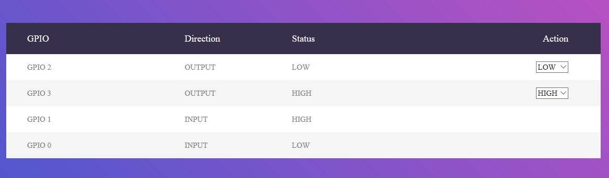

# pi-gpio-mqtt

Application for sending GPIO state updates to MQTT bus and update state according to messages from MQTT bus.
Has UI to see state and control pins directly.

## Getting Started


### Prerequisites

- Raspberry Pi with Java 8 for run
- Any system with Maven and java 8

You can build use the same Raspberry to build and run


### Build

- Clone repo
- Run
```
mvn package
```

## Deployment

 - copy target/smarthome-gpio.jar to any folder
 - create file application.yaml with in the same folder
 
 ```yaml 
 spring:
logging:
  level:
    smarthome.service: DEBUG
    org.eclipse.paho: INFO
io:
  input:
    - 0
    - 1
  output:
    - 2
    - 3
mqtt:
  brocker: tcp://192.168.0.4:1883
 ```
 Update this template with correct pin numbers 

## Run

execute 
```bash
java -jar smarthome-gpio.jar
```

Wait for start (on my Raspberry pi 1 it take ~120 seconds

## Using

Any input state change will produce message: **/java-switch/gpio/in/#*, where
State change on GPIO 2 pin will produce **/java-switch/gpio/in/#**
**java-switch** - hostname 
**GPIO 2** - pin number

Any message to  **/java-switch/gpio/out/#** will lead to change pin state

State change on GPIO 2 pin will produce **/java-switch/gpio/out/GPIO 2** message.

Message format:
 - change (set) state to **0** is **LOW**,
 - change (set) state to **1** is **HIGH**
 
Raspberry Pi host has simple UI to see and change pins state.
It is available by URL: http://java-switch:8080/io/



It can be run on Windows for test purposes. On Windows app will use mocked service for GPIO instead pi4j library.

 
 
 
 


